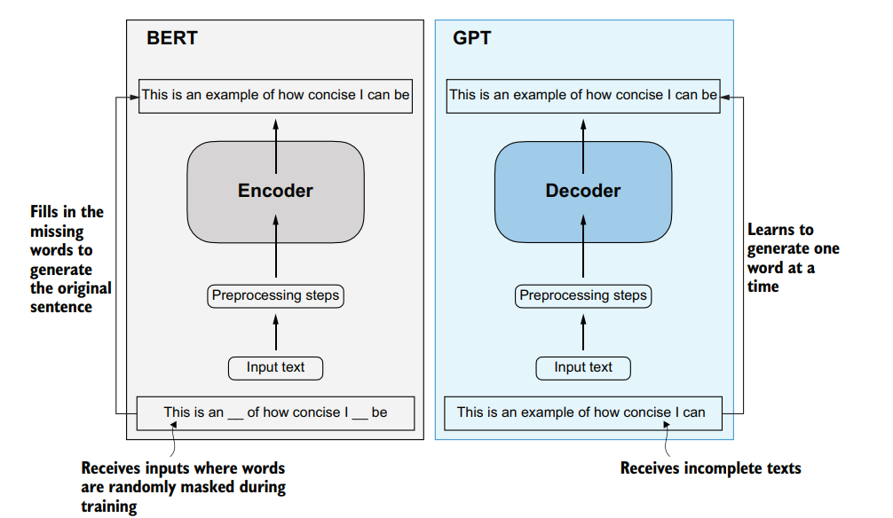
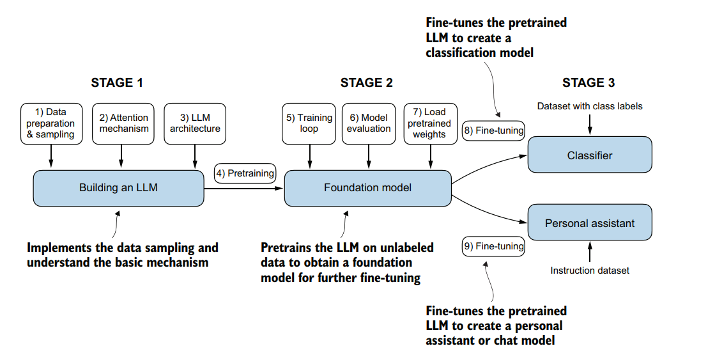

# GPT from Scratch

This repository contains the code and resources to build a GPT (Generative Pre-trained Transformer) model from scratch, following the book *"Build a Large Language Model (From Scratch)"* by Sebastian Raschka. The GPT architecture is a **decoder-only** transformer model, widely used for natural language generation tasks.

## Project Overview

The goal of this project is to implement a large language model (LLM) by following the structured approach outlined in the book. The repository includes code from **Chapter 2 to Chapter 7**, as Chapter 1 is an introduction. The process is divided into three main stages, as described below.

## Understanding the GPT Architecture

The GPT architecture is a decoder-only transformer model, which differs from the original transformer architecture introduced in the 2017 paper *"Attention is All You Need"* by Vaswani et al. The original transformer was designed for machine translation tasks and consisted of two main components:

- **Encoder**: Processes the input sequence (e.g., a sentence in the source language) to create a contextual representation.
- **Decoder**: Generates the output sequence (e.g., a translated sentence in the target language) by attending to the encoder's output and previously generated tokens.

This encoder-decoder structure was ideal for tasks like translation, where the model needs to map an input sequence to an output sequence.

In contrast, **GPT**, introduced by OpenAI in 2018, uses only the decoder part of the transformer. 



The key features of GPT's decoder-only architecture are:

- **Unidirectional Attention (Causal Attention)**: Unlike the original transformer's decoder, which could attend to both past and future tokens in the encoder, GPT's decoder uses masked self-attention to ensure that each token can only attend to previous tokens in the sequence. This makes it suitable for autoregressive tasks like text generation, where the model predicts the next token based on the preceding context.
- **No Encoder**: Since GPT is designed for generative tasks rather than sequence-to-sequence mapping, it does not require an encoder. The model takes an input sequence and generates the next token iteratively, making it ideal for tasks like language modeling.
- **Layered Structure**: GPT consists of multiple transformer decoder layers, each containing masked self-attention and feed-forward neural networks, followed by layer normalization. This stack of layers enables the model to capture complex patterns in language.

Large Language Models (LLMs) like those based on GPT leverage this decoder-only architecture for a variety of natural language processing tasks. By pretraining on vast amounts of text data, GPT models learn to predict the next token in a sequence, effectively capturing linguistic patterns, grammar, and even world knowledge. After pretraining, these models can be fine-tuned for specific tasks such as text generation, classification, or conversational applications (e.g., chatbots). The decoder-only design makes GPT particularly efficient for generative tasks, as it focuses solely on generating coherent and contextually relevant sequences without the need for an encoder to process a separate input sequence.


## Stages of Building the LLM

The development of the GPT model follows these stages, based on the methodology from the book:

### Stage 1: Building an LLM
1. **Data Preparation & Sampling**: Collect and preprocess the dataset to ensure quality input for training.
2. **Attention Mechanism**: Implement the core attention mechanism, a key component of the transformer architecture.
3. **LLM Architecture**: Construct the GPT model architecture (decoder-only).
4. **Pretraining**: Pretrain the model on a large, unlabeled dataset to learn general language patterns.

*Focus*: This stage emphasizes improving data sampling and understanding the basic mechanics of the LLM.

### Stage 2: Foundation Model
5. **Training Loop**: Develop the training loop to optimize the model during pretraining.
6. **Model Evaluation**: Evaluate the pretrained model to assess its performance.

*Focus*: Pretrain the LLM on unlabeled data to create a foundation model for further fine-tuning.

### Stage 3: Fine-tuning the LLM
The pretrained model can be fine-tuned for specific tasks:
- **Classification Model**:
  7. Load pretrained weights.
  8. Fine-tune the model on a dataset with class labels using a classifier.
- **Personal Assistant or Chat Model**:
  7. Load pretrained weights.
  9. Fine-tune the model on an instruction dataset to create a conversational agent.

## Repository Structure

- **Chapter 2**: Data preparation and sampling.
- **Chapter 3**: Implementing the attention mechanism.
- **Chapter 4**: Building the GPT (decoder-only) architecture.
- **Chapter 5**: Pretraining the model and setting up the training loop.
- **Chapter 6**: Model evaluation.
- **Chapter 7**: Fine-tuning for classification and conversational tasks.

Each chapter directory contains the corresponding code and documentation to guide you through the process of building the LLM.

## Getting Started

To get started, clone the repository and follow the instructions in each chapter directory. Ensure you have the necessary dependencies installed (e.g., Python, PyTorch, etc.), which will be detailed in a separate `requirements.txt` file.

```bash
git clone <repository-url>
cd gpt-from-scratch
```

Start with Chapter 2 to prepare your dataset and proceed sequentially through the chapters.

## Acknowledgments

This project is based on the teachings and structure provided in *"Build a Large Language Model (From Scratch)"* by Sebastian Raschka. The book provides a comprehensive guide to understanding and implementing LLMs, and this repository serves as a practical implementation of those concepts.
